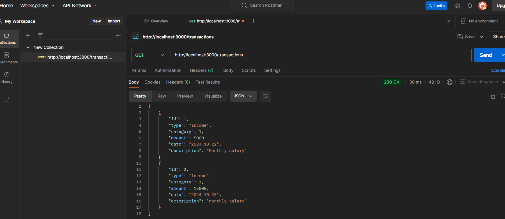
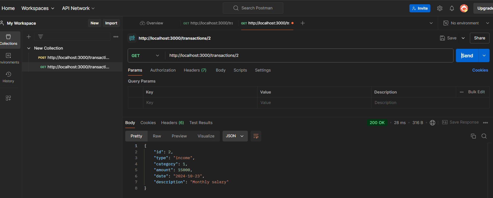
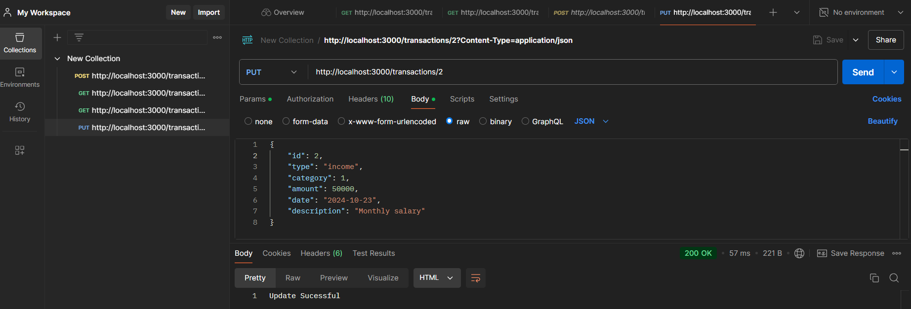
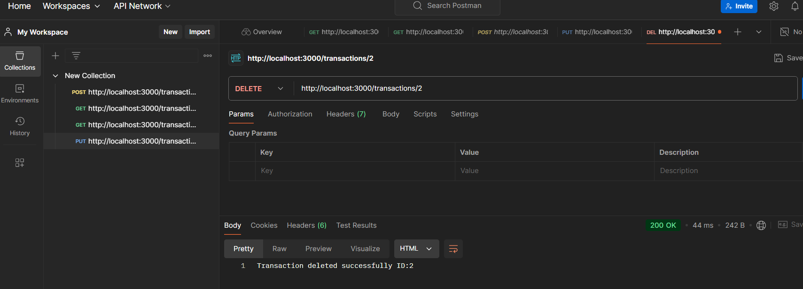
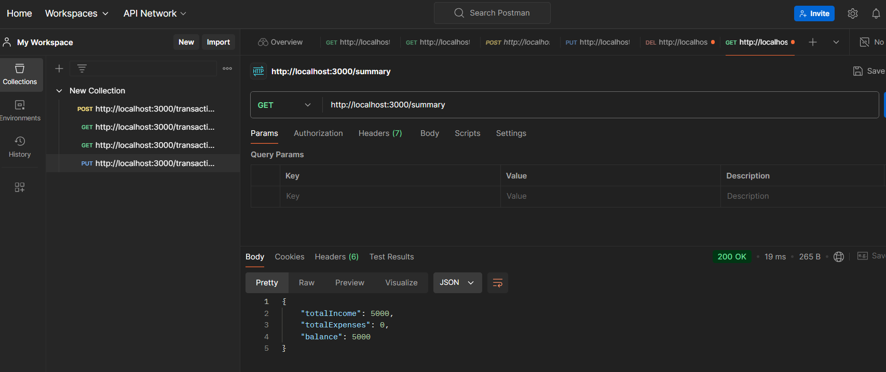

# Personal Expense Tracker API

## Description
The Personal Expense Tracker API is a RESTful API developed using Node.js and Express.js. It allows users to manage their personal financial records by recording income and expenses, retrieving past transactions, and obtaining summaries by category or time period.

## Table of Contents
- [Technologies](#technologies)
- [Features](#features)
- [Setup Instructions](#setup-instructions)
- [API Endpoints](#api-endpoints)
- [Testing with Postman](#testing-with-postman)
- [Screenshots](#screenshots)
- [Contributing](#contributing)
- [License](#license)

## Technologies
- **Backend Framework**: Node.js with Express.js
- **Database**: SQLite

## Features
- Record income and expenses
- Retrieve all transactions or specific ones by ID
- Update and delete transactions
- Get summary of transactions by category or date
- Error handling for invalid requests

## Setup Instructions
1. Clone the repository:
   ```bash
   git clone <your-repo-url>
   cd personal-expense-tracker

2. Install dependencies:
    npm install

3. Start the server:
    node server.js

4. The API will run on http://localhost:3000


## API Endpoints
1. POST/transactions
   Description: Adds a new transaction.
   Request Body:
   {
        "type": "income",
        "category": 1,
        "amount": 5000,
        "date": "2024-10-22",
        "description": "Monthly Salary"
   }

   Response:
   {
        "transactionId": 1
   }

2. GET/transactions
   Description: Retrieves all transactions.
   Response:
   [
    {
        "id": 1,
        "type": "income",
        "category": 1,
        "amount": 5000,
        "date": "2024-10-22",
        "description": "Monthly Salary"
    },
    {
        "id": 2,
        "type": "income",
        "category": 1,
        "amount": 15000,
        "date": "2024-10-23",
        "description": "Monthly Salary"
   },
  ]

3. GET/transactions/:id

   GET/transactions/:2 
   Description: Retrieves a transaction by ID.
   Response:
   {
        "id": 2,
        "type": "income",
        "category": 1,
        "amount": 15000,
        "date": "2024-10-23",
        "description": "Monthly Salary"
   }

4. PUT /transactions/:id

   PUT /transactions/:2
   Description: Updates a transaction by ID.
   Request Body:
   {
        "id": 2,
        "type": "income",
        "category": 1,
        "amount": 15000,
        "date": "2024-10-23",
        "description": "Monthly Salary"
   }
   Response:
   Update Successful

5. DELETE /transactions/:id
   Description: Deletes a transaction by ID.
   
   DELETE /transactions/2
   Response:
   Transaction deleted successfully ID:2

6. GET /summary
   Description: Retrieves a summary of transactions (total income, total expenses, and balance).
   Query Parameters:
   category 
   Response:
   {
  "totalIncome": 5000,
  "totalExpenses": 0,
  "balance": 5000
}


## Screenshots
Here are some screenshots of the API calls made using Postman:
1. POST/transactions
    
    

2. GET/transactions
    

3. GET/transactions/:2 
    

4. PUT /transactions/:2
    

5. DELETE /transactions/2
    

6. GET /summary
    


